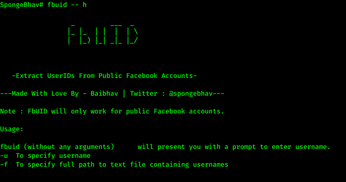

<h1 align="center" style="font-size:36px;font-weight:bold;"><pre style="background:null">
_         ___  _
|_ |_  | |  |  | \
|  |_) |_| _|_ |_/</pre> 
        -Extract UserIDs of public Facebook Profiles-
</h1>
<h4 align="center">
    <strong>Made with love by Baibhav Anand. (<a href='https://twitter.com/spongebhav' target="_blank">@spongebhav</a>)</strong>
</h4>

    

<h2 align="center">
  <strong>Introduction</strong>
 </h2>

*Note: FbUID only works with Public Facebook Accounts.*

As a developer, security researcher, bug bounty hunter, etc we often need the Facebook UserID of a user. For ex: userID for username: <strong>spongebhav</strong> is: <strong>100007536576842</strong>.

However, getting Facebook userID for a user can sometimes be time-consuming and a boring task.

To fix this problem, I present you guys with this tool: **FbUID**.

This tool is written completely in bash and can be used to extract userID for a public Facebook profiles if the username is known. You can specify a username or a text file containing a list of usernames to extract the userIDs from.

<h2 align="center">
  <strong>Auto Installation</strong>
 </h2>

* Download OR Clone the repository in your machine:
<pre>git clone https://github.com/baibhavanand/fbuid</pre>

* Switch to **fbuid** directory:
<pre>cd fbuid</pre>

* Give permissions to install.sh file:
<pre>sudo chmod 777 install.sh</pre>

* Run install.sh:
<pre>./install.sh</pre>

<h2 align="center">
  <strong>Manual Installation</strong>
 </h2>

* Download OR Clone the repository in your machine:
<pre>git clone https://github.com/baibhavanand/fbuid</pre>

* Switch to **fbuid** directory:
<pre>cd fbuid</pre>

* Give permissions to **fbuid**:
<pre>sudo chmod 777 fbuid</pre>

* Copy **fbuid** to **/usr/local/bin**
<pre>sudo cp fbuid /usr/local/bin/fbuid</pre>

<h2 align="center">
  <strong>Usage</strong>
 </h2>
 
 
 Arguments    | Description
------------- |-------------
(no arguments)            | Fbuid will launch and will ask for username input
-u            | Username can be passed through -u argument
-f            | File path containing usernames can be specified via -f argument

<h2 align="center">
  <strong>Examples</strong>
 </h2>
 
  <pre>fbuid</pre>
  Simply entering fbuid will prompt you to enter username and then show you the UserID for that username.
  
  

    

  
  <pre>fbuid -u (username)</pre>
  Username can also be passed via -u argument.
  
  

    

  <pre>fbuid -f (file path)</pre>
  Users can also pass a file with list of usernames using -f argument.
  
  

    

<h2 align="center">
  <strong>LICENSE</strong>
 </h2>
 
 FbUID is licensed under the MIT license. Take a look at the [LICENSE](https://github.com/baibhavanand/fbuid/blob/main/LICENSE) for more information.

<h2 align="center">
  <strong>Pull Requests</strong>
 </h2>

    

Please check [FbUID github page](https://github.com/baibhavanand/fbuid) for information regarding the kind of pull requests I am accepting.
    

<i>This project is maintained by <a href="https://github.com/baibhavanand">Baibhav Anand Jha</a> | Twitter: <a href="https://twitter.com/spongebhav">@spongebhav</a></i>

